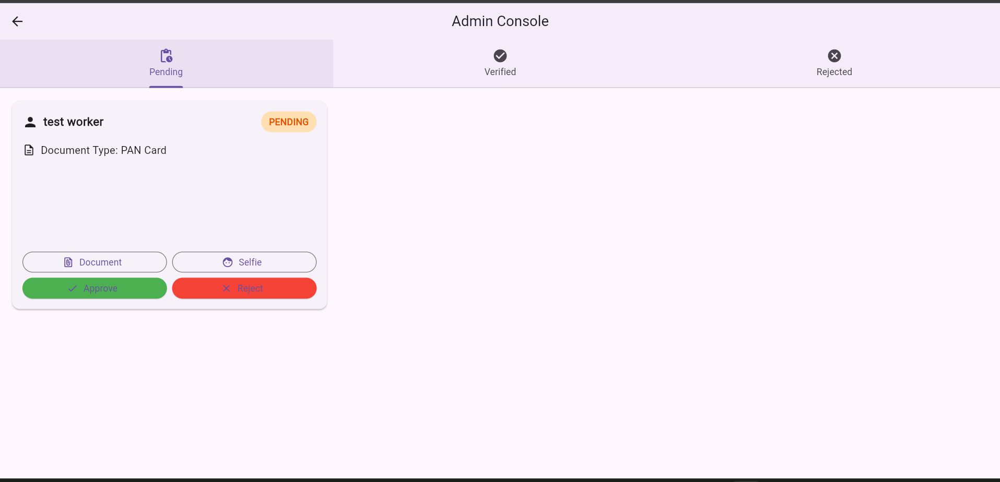

# Smart Utility Management App


A cross-platform mobile application that connects users with skilled utility workers (electricians, plumbers, carpenters, etc.). Users can browse and hire workers, while workers can receive job requests, manage profiles, and communicate with clients.

## Features

### For Users
- 🔍 Search and hire utility workers by category/location
- 💬 Real-time chat with workers
- 📄 Share job details/documents
- ⭐ Rate and review workers
- 👤 Profile management

### For Workers
- 📝 Create professional profile with skills/portfolio
- 📲 Receive job requests
- 📂 KYC document upload (Supabase)
- 💬 Client communication
- 🏆 Build reputation through ratings

## Tech Stack

### Frontend
- Flutter (Dart) - Cross-platform UI
- Provider - State management

### Backend
- **Firebase**:
  - Authentication (Email/Phone)
  - Realtime Database (Profiles, Jobs)
- **Supabase**:
  - Storage (KYC documents)
  - Database (Messages, Documents)

## Screenshots

| User Screens | Worker Screens |
|--------------|----------------|
|  Login |  Signup |
|  Home |  Dashboard |
|  Browse Workers |  KYC Upload |
|  Chat |  KYC Verified |
|   Admin Console |


## Installation

### Prerequisites
- Flutter SDK (v3.0+)
- Firebase account
- Supabase account

### Setup
1. Clone the repository:
   ```bash
   git clone https://github.com/Tabis-h/utility-managment-app.git
   
